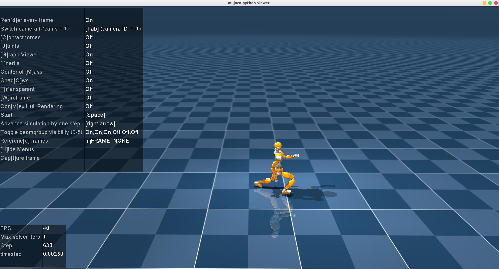

# LearningHumanoidRunning


Training humanoid robots to run using reinforcement learning, modified from the work at https://github.com/rohanpsingh/LearningHumanoidWalking, with additions including: 
1. Running using only legs.
2. Using hands for balance.
3. Running with both hands and legs simultaneously.

Added 14 new arm joints, increasing the observation dimension from 37 to 65, and added some reward functions related to arm movements to support the training of robotic arm operations.

## Code structure:
A rough outline for the repository that might be useful for adding your own robot:
```
LearningHumanoidWalking/
├── envs/                <-- Actions and observation space, PD gains, simulation step, control decimation, init, ...
├── tasks/               <-- Reward function, termination conditions, and more...
├── rl/                  <-- Code for PPO, actor/critic networks, observation normalization process...
├── models/              <-- MuJoCo model files: XMLs/meshes/textures
├── trained/             <-- Contains pretrained model for JVRC
└── scripts/             <-- Utility scripts, etc.
```

## Requirements:
- Python version: 3.7.11  
- [Pytorch](https://pytorch.org/)
- pip install:
  - mujoco==2.2.0
  - [mujoco-python-viewer](https://github.com/rohanpsingh/mujoco-python-viewer)
  - ray==1.9.2
  - transforms3d
  - matplotlib
  - scipy

## Usage:

Environment names supported:  

| Task Description                | Environment name |
|---------------------------------|------------------|
| Basic Walking Task              | 'jvrc_walk'      |
| Stepping Task (using footsteps) | 'jvrc_step'      |
| Walking Task (using arm)        | 'jvrc_arm'       |
| run Task (only using leg)       | 'jvrc_run'       |
| run Task (using leg and arm)    | 'jvrc_run_arm'       |


#### **To train:** 

```
$ python run_experiment.py train --logdir <path_to_exp_dir> --num_procs <num_of_cpu_procs> --env <name_of_environment>
```  

```
# 训练指令
python run_experiment.py train --env jvrc_run --logdir ./logs/test --num_procs 4 --n_itr 10 --seed 42
```

```
# 接着在旧实验/experiments/jvcr_run的基础上继续训练指令
python run_experiment.py train --env jvrc_run --logdir ./logs/test --num_procs 4 --n_itr 10 --seed 42 --continued ./experiments/jvcr_run
```


#### **To play:**

We need to write a script specific to each environment.    
For example, `debug_stepper.py` can be used with the `jvrc_step` environment.  
```
$ PYTHONPATH=.:$PYTHONPATH python scripts/debug_stepper.py --path <path_to_exp_dir>
```

```
python scripts/debug_stepper.py --path experiments/jvcr_run_arm
```


#### **What you should see:**

https://github.com/user-attachments/assets/08628f41-29f4-463e-947a-f9cd4d0b210c

**


#### jvrc项目系统数据流
##### 1）系统的物理意义上的输入输出
```
┌──────────────────────────────────┐
│     虚拟环境（MuJoCo仿真）       │
│                                  │
│   机器人状态：位置、速度、加速度 │
│   └─ 环境返回观测（observation) │
└────────────┬─────────────────────┘
             ↓
      ┌────────────────┐
      │  Actor网络     │
      │ (策略网络)     │
      │  输入：obs     │
      │  输出：action  │
      └────────┬───────┘
             ↓
┌──────────────────────────────────┐
│   机器人执行动作                 │
│   └─ 每个关节收到目标位置        │
│      通过PD控制转换为扭矩        │
└──────────────────────────────────┘
```

##### 2）具体的输入：Observation（观测状态）
环境通过 get_obs() 返回的65维向量（jvrc_run_arm.py:167-192）：
```
def get_obs(self):
    # 外部状态：步态相位（时钟信号）
    clock = [np.sin(2 * np.pi * self.task._phase / self.task._period),
             np.cos(2 * np.pi * self.task._phase / self.task._period)]  # 2维
    ext_state = np.concatenate((clock, self.task.mode.encode(), [self.task.mode_ref]))  # 6维
    
    # 内部状态：机器人状态
    qpos = np.copy(self.interface.get_qpos())  # 从MuJoCo读取位置
    qvel = np.copy(self.interface.get_qvel())  # 从MuJoCo读取速度
    
    # 根身体朝向（四元数）
    root_orient = tf3.euler.euler2quat(root_r, root_p, 0)  # 4维
    root_ang_vel = qvel[3:6]  # 3维（角速度）
    
    # 26个执行器的位置和速度
    motor_pos = [motor_pos[i] for i in self.actuators]  # 26维
    motor_vel = [motor_vel[i] for i in self.actuators]  # 26维
    
    # 组合
    robot_state = np.concatenate([
        root_orient,    # 4维
        root_ang_vel,   # 3维
        motor_pos,      # 26维
        motor_vel,      # 26维
    ])  # 总共 59维
    
    state = np.concatenate([robot_state, ext_state])  # 59 + 6 = 65维
    return state.flatten()
```
观测向量的具体内容：
```
obs = [
  0:3    → 根身体朝向（四元数，4维）
  4:6    → 根身体角速度（3维）
  7:32   → 26个执行器位置（弧度）
  33:58  → 26个执行器速度（弧度/秒）
  59:60  → 步态相位 sin/cos（2维）
  61:63  → 行走模式编码（3维）
  64     → 模式参考值（1维）
]
总计：65维
```


##### 3）具体的输出：Action（动作）

动作是什么？
Actor 网络输出的26维向量（actor.py:242-258）：
```
def forward(self, state, deterministic=True, anneal=1.0):
    """
    输入：state = 65维观测向量
    输出：action = 26维动作向量
    """
    mu, sd = self._get_dist_params(state)  # 获取高斯分布的均值和标准差
    sd *= anneal  # 探索退火
    
    if not deterministic:
        # 随机采样：a ~ N(mu, sd^2)
        self.action = torch.distributions.Normal(mu, sd).sample()
    else:
        # 确定性：直接用均值
        self.action = mu
    
    return self.action  # 返回 26维向量
```
动作向量的具体含义：
```
action = [
  0:5    → 右腿6个关节的目标位置变化（弧度）
  6:11   → 左腿6个关节的目标位置变化（弧度）
  12:18  → 右臂7个关节的目标位置变化（弧度）
  19:25  → 左臂7个关节的目标位置变化（弧度）
]
总计：26维
```

##### 4) 从动作到执行：完整链路

Step 1: 策略输出动作
```
obs = env.reset()  # obs.shape = (65,)

action = policy(torch.Tensor(obs), deterministic=True)  
# action.shape = (26,)
# 例如：action = [0.1, -0.05, 0.03, ..., 0.02]
```
Step 2: 环境执行动作
jvrc_run_arm.py:193-210：
```
def step(self, a):
    """
    输入：a = 26维动作向量
    """
    # 传给机器人
    applied_action = self.robot.step(a)
    
    # 计算奖励
    rewards = self.task.calc_reward(...)
    
    # 返回新状态
    obs = self.get_obs()  # 新的 65维观测
    return obs, reward, done, info
```

Step 3: 机器人类映射动作到控制
robot_arm.py:87-115：
```
def step(self, action):
    """
    输入：26维策略动作
    输出：执行后的动作（已加偏置）
    """
    # 1. 创建与执行器数量相同的动作向量
    filtered_action = np.zeros(len(self.motor_offset))
    
    # 2. 将策略动作映射到执行器
    for idx, act_id in enumerate(self.actuators):
        filtered_action[act_id] = action[idx]
    
    # 3. 加上标称姿态偏置（中立姿势）
    filtered_action += self.motor_offset
    # 现在 filtered_action = [目标位置1, 目标位置2, ...]
    
    # 4. PD 控制：将目标位置转换为扭矩
    self.do_simulation(filtered_action, self.frame_skip)
    
    return filtered_action
```

Step 4: PD 控制执行
robot_arm.py:117-128：
```
def do_simulation(self, target, n_frames):
    """
    输入：target = 26个执行器的目标位置
    """
    ratio = self.client.get_gear_ratios()
    
    # 循环 n_frames 次（frame_skip=10）
    for _ in range(n_frames):
        # PD 控制：计算扭矩
        # tau = Kp * (target - current_pos) + Kd * (0 - current_vel)
        tau = self.client.step_pd(target, np.zeros(self.client.nu()))
        
        # 考虑齿轮比
        tau = [(i / j) for i, j in zip(tau, ratio)]
        
        # 写入执行器
        self.client.set_motor_torque(tau)
        
        # MuJoCo 仿真一步
        self.client.step()
```
##### 5) 完整的一个 Step 的流程图
```
┌─────────────────────────────────────────────────────┐
│ 时刻 t：机器人当前状态                               │
│                                                     │
│ 位置（qpos）: [根x, 根y, 根z, 根旋转, 关节1, ...] │
│ 速度（qvel）: [根vx, 根vy, 根vz, 根ωx, ...]       │
└────────────────┬────────────────────────────────────┘
                 ↓
    ┌────────────────────────────────────┐
    │ env.get_obs()                      │
    │ 提取：朝向、角速度、关节位置、     │
    │       关节速度、步态相位等         │
    │ 返回：obs (65维)                  │
    └────────────┬───────────────────────┘
                 ↓
    ┌────────────────────────────────────┐
    │ policy(obs)                        │
    │ Actor 网络前向传播：               │
    │ 65维 obs →[MLP]→ 26维 action      │
    │                                    │
    │ action = μ + σ·ε (高斯采样)      │
    │ 或 action = μ (确定性)            │
    └────────────┬───────────────────────┘
                 ↓
    ┌────────────────────────────────────┐
    │ robot.step(action)                 │
    │ 1. 加偏置：action += nominal_pose │
    │ 2. PD 控制：                       │
    │    tau = Kp*(target-pos) +        │
    │           Kd*(0-vel)              │
    │ 3. 执行扭矩（10次模拟步）        │
    └────────────┬───────────────────────┘
                 ↓
    ┌────────────────────────────────────┐
    │ MuJoCo 物理仿真（10步）           │
    │ 计算动力学：新的位置、速度        │
    └────────────┬───────────────────────┘
                 ↓
┌─────────────────────────────────────────────────────┐
│ 时刻 t+1：新的机器人状态                             │
│                                                     │
│ 返回：                                              │
│ - obs_new (65维)  ← 新观测                         │
│ - reward (标量)   ← 奖励                           │
│ - done (布尔)     ← 是否终止                       │
│ - info (dict)     ← 其他信息                       │
└─────────────────────────────────────────────────────┘
```

##### 6) 具体数值示例
假设某一时刻：

输入（Observation）：
```
obs = np.array([
    # 根朝向（四元数）
    1.0, 0.02, -0.01, 0.015,
    # 根角速度
    0.05, 0.02, 0.1,
    # 26个关节位置（弧度）
    -0.52, 0.0, 0.0, 0.87, 0.0, -0.42,      # 右腿
    -0.52, 0.0, 0.0, 0.87, 0.0, -0.42,      # 左腿
    0.0, 0.3, 0.0, -1.0, 0.0, 0.0, 0.0,    # 右臂
    0.0, 0.3, 0.0, -1.0, 0.0, 0.0, 0.0,    # 左臂
    # 26个关节速度（弧度/秒）
    0.1, -0.05, 0.02, 0.15, -0.02, 0.08,    # 右腿
    0.1, -0.05, 0.02, 0.15, -0.02, 0.08,    # 左腿
    0.0, 0.0, 0.0, 0.0, 0.0, 0.0, 0.0,     # 右臂
    0.0, 0.0, 0.0, 0.0, 0.0, 0.0, 0.0,     # 左臂
    # 步态相位
    0.95, 0.32,
    # 模式编码
    1.0, 0.0, 0.0,
    # 模式参考值
    6.0
])  # 总计 65 维
```
策略输出（Action）：
```
action = np.array([
    # 右腿 6 个关节的目标位置变化
    0.05, -0.02, 0.01, 0.08, -0.01, 0.03,
    # 左腿 6 个关节的目标位置变化
    0.04, -0.03, 0.02, 0.07, 0.0, 0.02,
    # 右臂 7 个关节的目标位置变化
    -0.01, 0.02, 0.0, -0.05, 0.01, 0.0, 0.0,
    # 左臂 7 个关节的目标位置变化
    -0.01, 0.02, 0.0, -0.05, 0.01, 0.0, 0.0,
])  # 总计 26 维
```
执行过程：
```
1. action 加上标称姿态偏置：
   target_pos = action + nominal_pose
   = [0.05 + (-0.52), -0.02 + 0.0, ...] = [-0.47, -0.02, ...]

2. PD 控制计算扭矩：
   tau = Kp[i] * (target_pos[i] - current_pos[i]) 
       + Kd[i] * (0 - current_vel[i])
   
   例如关节 0（右髋俯仰）：
   tau[0] = 200 * (-0.47 - (-0.52)) + 20 * (0 - 0.1)
          = 200 * 0.05 + 20 * (-0.1)
          = 10 - 2 = 8 N·m

3. MuJoCo 物理仿真 10 步，执行这个扭矩
   → 机器人向目标位置移动

4. 返回新观测：obs_new (65维)
```

##### 7) 一个完整的 Episode
```
# Episode 开始
obs = env.reset()  # 初始观测 (65维)
total_reward = 0
done = False
step = 0

while not done and step < 400:  # 最多 400 步
    # 策略推理
    action = policy(torch.Tensor(obs), deterministic=True)  # 26维
    
    # 环境执行
    obs, reward, done, info = env.step(action.numpy())
    
    # 累积奖励
    total_reward += reward
    step += 1

# Episode 结束
print(f"Episode Return: {total_reward}, Length: {step}")
```

##### 总结

|角色 | 维度 | 含义
| :---- | ----:  | :-------: |
输入（观测）|	65维 | 机器人位置、速度、朝向、步态相位等 |
输出（动作）|	26维 |	26个执行器的目标位置变化量 | 
转换	| - |	PD 控制 + MuJoCo 物理仿真 | 
